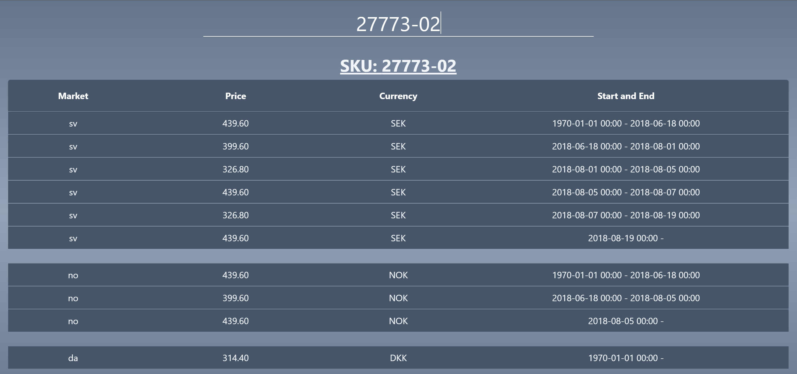

# Optimized SKU Pricing
Code test for Nordic Nest 2023



A web app, .NET 7.0 and React, for displaying the optimal price for a SKU based on the data in the `price_detail.csv` file.

## How to run

### Clone the repository
```bash
git clone git@github.com:oenstrom/code_test_nordic_nest_2023.git
```

### Navigate to the project directory
```bash
cd code_test_nordic_nest_2023
```

### Restore NuGet packages
```bash
dotnet restore
```

### Install front-end dependencies
```bash
cd src/ClientApp
npm install
```

### Build the project
```bash
cd ..
dotnet build
```

### Run the project
```bash
dotnet run
```
At the first run, the database will be seeded with data from the `price_detail.csv` file. This may take a while.

### Open the project in a browser
```bash
http://localhost:5270
```
The client will be built and you will be redirected to the home page.

